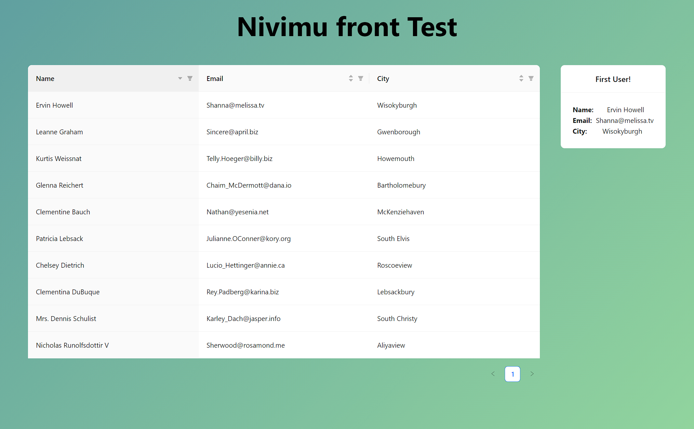

# NIVIMU Front-End Test Code

This project was bootstrapped with [Create React App](https://github.com/facebook/create-react-app), using the [Redux](https://redux.js.org/) and [Redux Toolkit](https://redux-toolkit.js.org/) TS template. _For the sake of time, really._

### Thechnologies:

- TypeScript
- React
- CSS
- Ant Design
- Redux Toolkit
- Jest

## Test Instructions

1. Create table comp from Ant Design with 3 columns: Name, Email, City.
2. Load data for table from: https://jsonplaceholder.typicode.com/users.
3. Use Redux or alternative.
4. Add **filter** and **sorter** functionality to table
5. Add new card component to **displaying always first row data** of table

## Result
You can check the result in this pabe: https://aslansn.github.io/nivimu-front-codetest/

But if you don't wanna here is a preview:

## Execution

> _All the process I'm going to explain may be sorta intuitive reading all the commits I did on the github repository of this test._

I started by setting up al the redux toolkit skeleton, wiping out its template's excess (counter component) and creating my own slice (users). Then I looked forward to sick the types and interface needed at the moment to get all the data from the provided url.

Then the activation of the fetch should be on the render of the main component called Users.tsx, for I needed to prevent a double fetching by using a switch boolean.

I had to handle all the info the fetch was retreiving, so I converted the users objects I received from the API to a clean, non superflual Users' Array for the data I needed.

There I used a **class** constructor for its factorization but I got a bug and realized Redux storage looks to a plain, serializable content in it for which class constructors are not a good practice, it seems.

Once the users where correctly stored and the Async Thunk doing the fetch tested I had to deep in **Ant Design** components to correctly build the **Table**. Then I saw that I needed to store an array of strings in order to create the needed filters for each column's table.

So I decided the info I would filter with (First names for the names, domains for the emails, and all the city's name). I used Regulated Expresions for it as I think it is the most capable and easy way to properly filter data. I created a function a part of the slice as a Util that would get the array.

Having clear I couldn't use classes' constructrors I had to create another util function to create the filters in a way Ant Design dependency would understand properly.

Once all done I tested it until everything worked as desired.

The table was done, everything tested, everything working fine. Now I had to do the fifth step:

> "Add a new card component to **displaying always first row data** of table."

Hence I found the card on Ant Design's web and created it easily. But now I had another issue, **how the heck would I extract the info from inside the Ant Desing's table???**

Well, easy enough, just had to create an onChange event to extract each time the table changed its content and then its first users. Now I had another minor problem, it is **OnChange** not **OnRender** so I had to implement the _same_ sorting the table was doing for, once the fetch was fulfilled, the firs user would appear on its card. Easy peasy lemon squishy.

I did it! Everything tested another time, everything working!

And then this README was full,  
I shall sleep, 
Tata~

### Available Scripts

In the project directory, you can run:

#### `npm start`

Runs the app in the development mode.\
Open [http://localhost:3000](http://localhost:3000) to view it in the browser.

The page will reload if you make edits.\
You will also see any lint errors in the console.

#### `npm test`

Launches the test runner in the interactive watch mode.\
See the section about [running tests](https://facebook.github.io/create-react-app/docs/running-tests) for more information.

#### `npm run build`

Builds the app for production to the `build` folder.\
It correctly bundles React in production mode and optimizes the build for the best performance.

The build is minified and the filenames include the hashes.\
Your app is ready to be deployed!

See the section about [deployment](https://facebook.github.io/create-react-app/docs/deployment) for more information.
